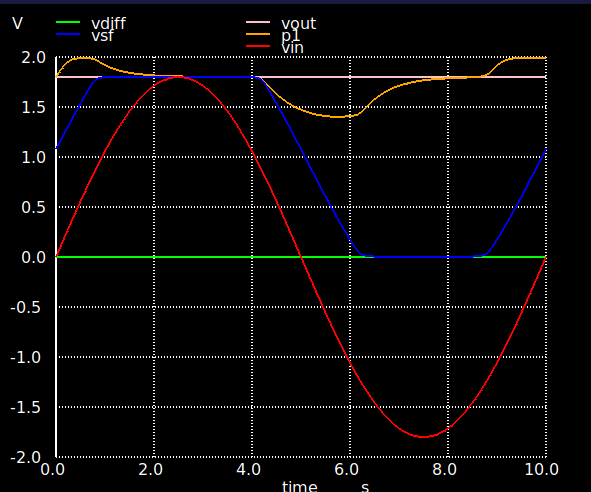
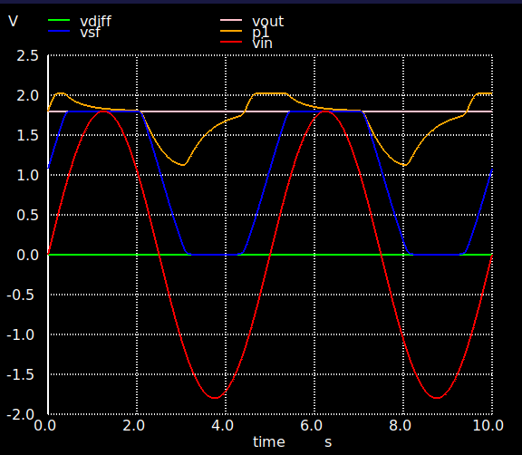
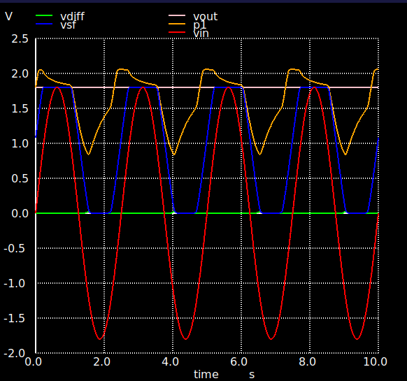
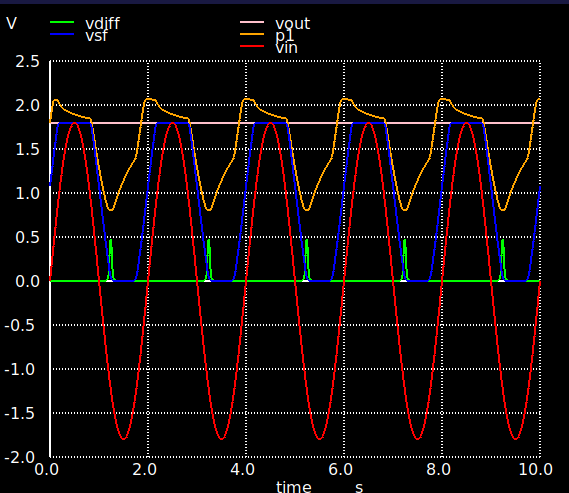
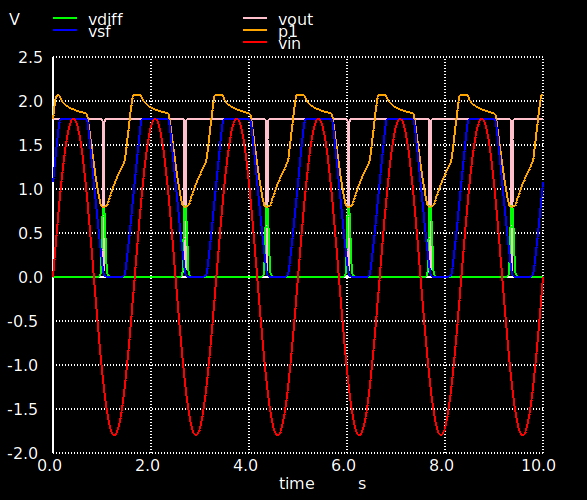

# Asynchronous Delta Modulator (ATS)

An analog-to-spike converter circuit implemented in the [SkyWater SKY130](https://github.com/google/skywater-pdk) open-source PDK. The circuit encodes continuous analog signals into asynchronous spike trains — firing a pulse each time the input changes by a threshold delta — inspired by event-driven neural encoding.

---

## How It Works

The circuit monitors an analog input (Vin) through a PFET source follower (M6/M7) that produces a buffered signal (Vsf). A capacitively-coupled node (P1) tracks changes in Vsf via C1. When the input delta is large enough, P1 rises past the comparator threshold, causing the comparator (M1/M4) to tip and fire a spike on Vout. M5 then resets the comparator state, preparing the circuit for the next spike.

```
Vin ──► Source Follower (M6/M7) ──► Vsf
                                      │
                                     C1
                                      │
                                      P1 ──► Comparator (M1/M4) ──► Vout
                                      │           │
                                     C2          M5 (reset, gate=Vout)
                                      │
                                    Vdiff
```

### Key Signals

| Signal  | Description |
|---------|-------------|
| `Vin`   | Analog input (sine wave or ramp) |
| `Vsf`   | Source follower output — buffered Vin |
| `P1`    | AC-coupled comparator input node (C1 between Vsf and P1) |
| `Vdiff` | Comparator output node (M1 vs M4 competition) |
| `Vout`  | Spike output — pulses HIGH when input delta exceeds threshold |

### Bias Inputs

| Signal  | Typical Value | Role |
|---------|--------------|------|
| `Vdn`   | 0.44 – 0.5 V | Sets comparator threshold via M1 tail current |
| `Vb1`   | self-biased  | Source follower load current (M7/M12/M14) |
| `Vonn`  | self-biased  | Output pull-down bias (M2/M19/M20) |

---

## Verified Operating Range

| Parameter | Range |
|-----------|-------|
| Supply voltage | 1.8 V |
| Input frequency | 1 – 100 Hz |
| Vdn bias | 0.44 – 0.5 V |
| Input amplitude | up to ±1.8 V |

---

## Circuit Versions

| Version | Schematic | Notes |
|---------|-----------|-------|
| V0.0 | `testbenches/ATS_V0.0_tb.sch` | Initial prototype |
| V0.1 | `testbenches/ATS_V0.1_tb.sch` | Self-reset rework (current) |

### V0.1 Changes vs V0.0

- **M5 gate** tied directly to `Vout` (previously driven through M8/M9/C3 network)
- **M5 width** increased 1.2 → 4.8 µm (4×) for stronger P1→Vdiff pull-up during reset
- **C2** reduced 4×4 → 1×1 µm (~32 fF → 2 fF) to lower Vdiff node capacitance, improving P1 drive efficiency
- **M8/M9/C3** removed — reset path simplified to single transistor

---

## Repository Structure

```
.
├── testbenches/
│   ├── ATS_V0.0_tb.sch         # V0.0 xschem testbench
│   ├── ATS_V0.1_tb.sch         # V0.1 xschem testbench (current)
│   └── AnalogToSpike_tb.sch    # Top-level testbench
└── scripts/
    └── ngspice/
        ├── ATS_V0.1.spice      # Netlist for ngspice simulation
        └── sym.spice           # Simulation commands and stimulus
```

---

## Running Simulations

### Prerequisites

- [xschem](https://xschem.sourceforge.io/) — schematic editor
- [ngspice](https://ngspice.sourceforge.io/) — SPICE simulator
- [SkyWater SKY130 PDK](https://github.com/google/skywater-pdk) installed at `/foss/pdks/sky130A/`

### Steps

1. Open the testbench in xschem:
   ```bash
   xschem testbenches/ATS_V0.1_tb.sch
   ```

2. Click **Netlist & Sim** in the schematic to generate the netlist and launch ngspice, or run directly:
   ```bash
   ngspice scripts/ngspice/ATS_V0.1.spice
   ```

3. Simulation cases are defined in `scripts/ngspice/sym.spice`. Uncomment the desired case:

   | Case | Frequency | Runtime |
   |------|-----------|---------|
   | Case #1 | 100 Hz | 40 ms |
   | Case #2 | 10 Hz | 400 ms |
   | Case #3 | 1 Hz | 10 s |

---

## Initial Conditions

To avoid startup latch-up, the following initial conditions are applied:

```spice
.ic v(vout)=0 v(p1)=1.8 v(vsf)=0.9
```

---

## Example Simulation Results

All plots show `vdiff` (green), `vsf` (blue), `vout` (white), `p1` (orange), `vin` (red) over a 10 s transient with a sine wave input and Vdn = 0.47 V.

### 0.1 Hz


### 0.3 Hz


### 0.5 Hz


### 0.8 Hz


### 1.0 Hz


As frequency increases, the circuit fires more spikes per cycle as the input slope exceeds the reset rate, demonstrating correct delta modulation behaviour across the verified 1–100 Hz operating window.

---

## License

This project uses the [SkyWater SKY130 PDK](https://github.com/google/skywater-pdk) under the [Apache 2.0 License](https://www.apache.org/licenses/LICENSE-2.0).
